# ATM系统课程作业方案

## 1. 作业概述

本作业以 ATM 自动取款机系统为对象，围绕软件分析、设计与建模要求，完成两部分交付内容：

- 代码交付实施方案与技术栈选择
- UML 建模作业交付方案

本方案采用前后端分离架构，前端使用 Vue，后端使用 Java Spring Boot，并使用 Mermaid 绘制 UML 与系统结构图，便于在 Markdown 文档中统一管理和展示。

---

## 2. 代码交付实施方案

### 2.1 建设目标

实现一个虚拟 ATM 系统，支持以下核心业务：

- 插卡登录
- 密码验证
- 查询余额
- 取款
- 存款
- 转账
- 修改密码
- 打印凭条
- 退卡

系统以课程作业为目标，重点体现需求分析、模块划分、业务流程与前后端协作，不追求真实银行级安全实现。

### 2.2 技术栈选择

#### 前端技术栈

- Vue 3
- Vite
- Vue Router
- Pinia
- Element Plus
- Axios

#### 后端技术栈

- Java 17
- Spring Boot 3
- Spring Web
- Spring Validation
- MyBatis 或 Spring Data JPA
- Swagger / OpenAPI

#### 数据库与部署

- MySQL 8
- Nginx
- Spring Boot Jar 部署

### 2.3 技术选型说明

选择上述技术栈的原因如下：

- Vue 3 适合快速构建课程项目界面，开发效率高。
- Element Plus 可以快速完成 ATM 风格的业务页面。
- Spring Boot 适合构建清晰的业务接口，便于实现账户、认证和交易模块。
- MySQL 适合保存账户、银行卡、交易流水等结构化数据。
- 前后端分离便于分工、联调和后期演示。

### 2.4 系统总体架构

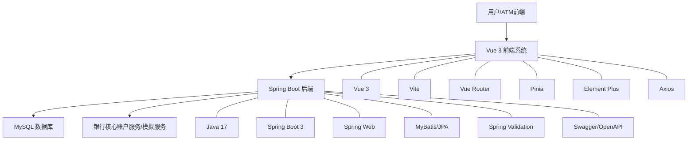

### 2.5 功能模块划分

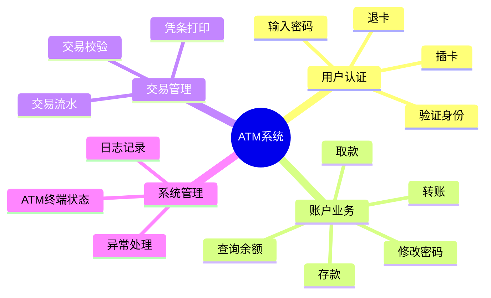

### 2.6 项目实施计划

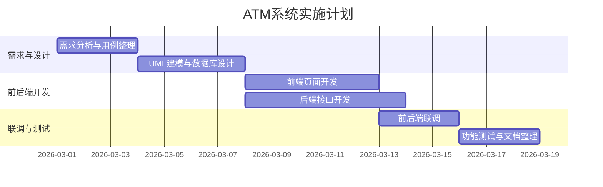

### 2.7 核心数据库设计

#### 核心数据表

- `customer`：客户信息表
- `bank_card`：银行卡信息表
- `account`：账户信息表
- `transaction_record`：交易流水表
- `atm_device`：ATM 设备信息表

#### 实体关系图

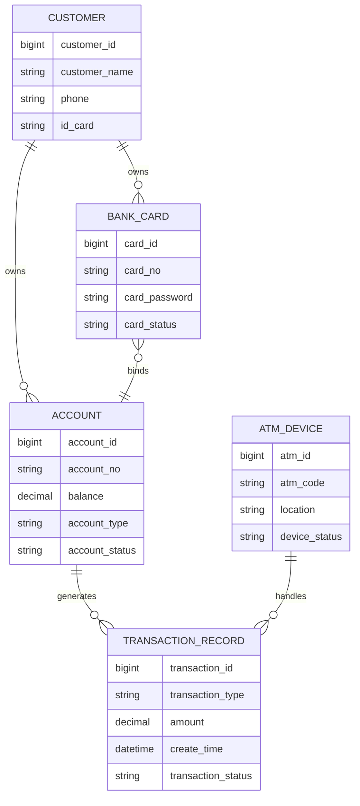

### 2.8 项目目录建议

```text
ATM_Design/
├── atm-ui/                  前端 Vue 项目
├── atm-server/              后端 Spring Boot 项目
├── sql/                     数据库脚本
├── docs/                    设计文档与接口文档
└── ATM_UML作业方案.md       当前作业文档
```

### 2.9 代码交付建议

建议按三个迭代完成开发：

#### 迭代一

- 插卡登录
- 密码验证
- 查询余额

#### 迭代二

- 取款
- 存款
- 转账
- 修改密码

#### 迭代三

- 打印凭条
- 交易流水
- 异常处理
- 系统部署与演示

---

## 3. UML 作业交付方案

### 3.1 文档组织方式

根据实验要求，建议按 UP 过程组织文档：

- 第一章 初始阶段
- 第二章 细化迭代 1
- 第三章 细化迭代 2
- 第四章 细化迭代 3
- 第五章 总结与部署

---

## 4. 第一章 初始阶段

### 4.1 系统背景

ATM 自动取款机系统是银行业务流程中的重要组成部分。为了提高银行业务处理效率，减少柜台人员压力，并为客户提供便捷的自助服务，需要开发一个具备取款、存款、查询、转账等功能的 ATM 系统。

本系统以模拟银行自助服务终端为目标，建立一个可演示、可建模、可扩展的虚拟 ATM 系统。

### 4.2 参与者识别

系统的主要参与者包括：

- 客户
- 银行核心系统
- 管理员（可选）

### 4.3 用例图

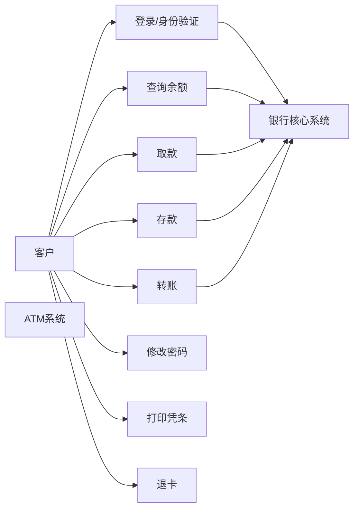

### 4.4 核心用例规约

#### 用例一：取款

- 用例名称：取款
- 用例编号：SUC001
- 参与者：客户
- 用例简述：客户在 ATM 机上完成取款操作

主要流程：

1. 客户插入银行卡。
2. 系统提示输入密码。
3. 客户输入密码，系统验证通过。
4. 系统显示业务菜单。
5. 客户选择取款并输入取款金额。
6. 系统检查金额合法性与账户余额。
7. 系统完成扣款。
8. ATM 吐钞。
9. 系统提示是否打印凭条。
10. 客户选择后退卡，交易结束。

替代流程：

1. 密码错误，系统提示重新输入。
2. 余额不足，系统提示交易失败。
3. ATM 现金不足，系统提示无法完成交易。

#### 用例二：查询余额

- 用例名称：查询余额
- 用例编号：SUC002
- 参与者：客户
- 用例简述：客户通过 ATM 查询账户余额

主要流程：

1. 客户插卡并输入密码。
2. 系统验证身份。
3. 客户选择查询余额。
4. 系统读取账户余额信息。
5. 系统显示查询结果。

#### 用例三：转账

- 用例名称：转账
- 用例编号：SUC003
- 参与者：客户
- 用例简述：客户在 ATM 上向其他账户转账

主要流程：

1. 客户完成登录。
2. 客户选择转账功能。
3. 输入目标账户和金额。
4. 系统校验目标账户是否存在。
5. 系统校验当前账户余额。
6. 系统完成扣款和入账。
7. 记录交易流水。
8. 系统提示转账成功。

---

## 5. 第二章 细化迭代 1

### 5.1 分析类图

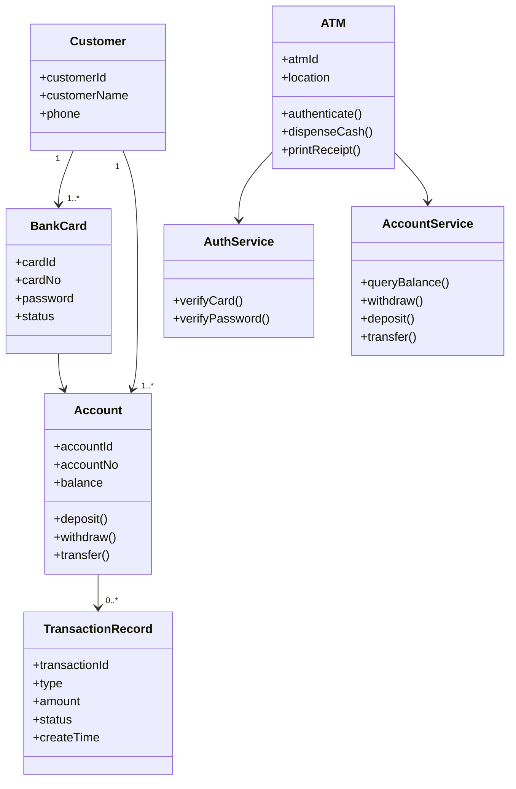

### 5.2 取款活动图

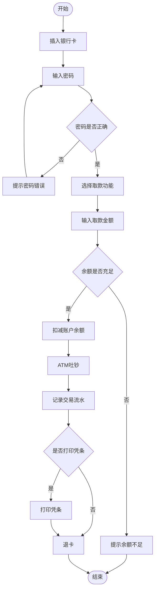

### 5.3 登录认证顺序图

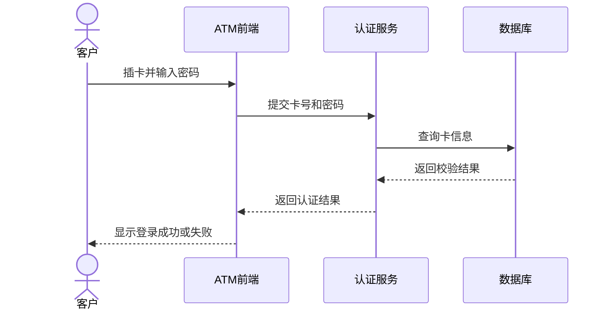

### 5.4 取款顺序图

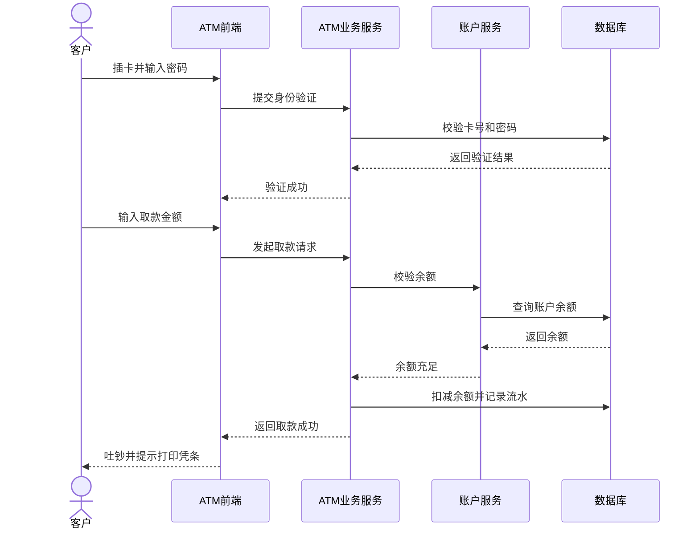

---

## 6. 第三章 细化迭代 2

### 6.1 设计类图

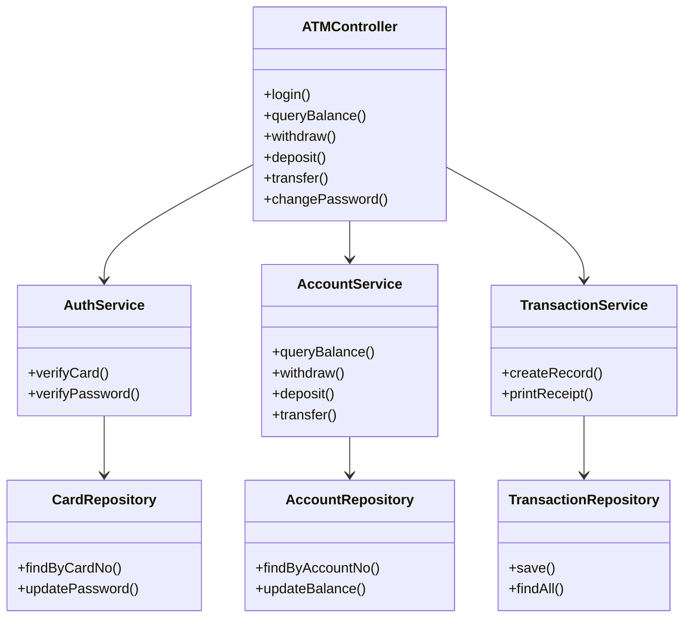

### 6.2 转账顺序图

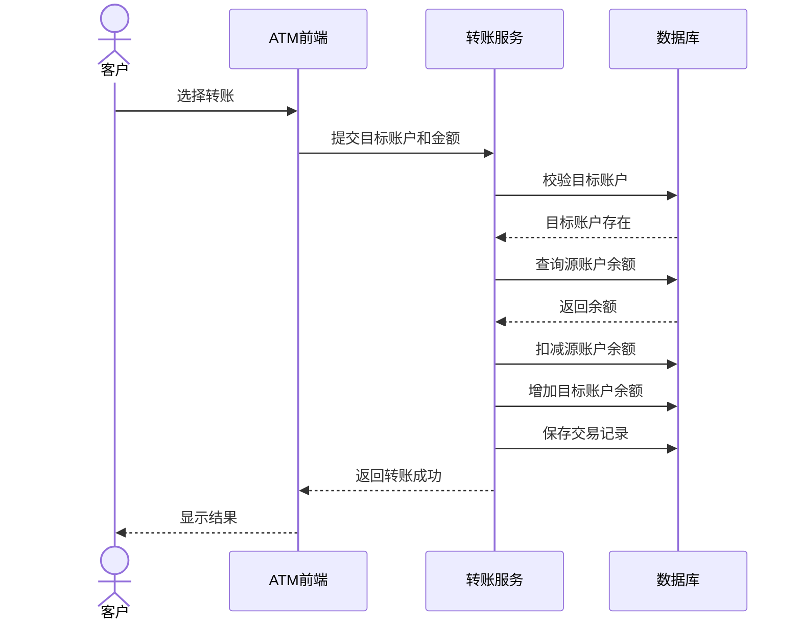

### 6.3 存款顺序图

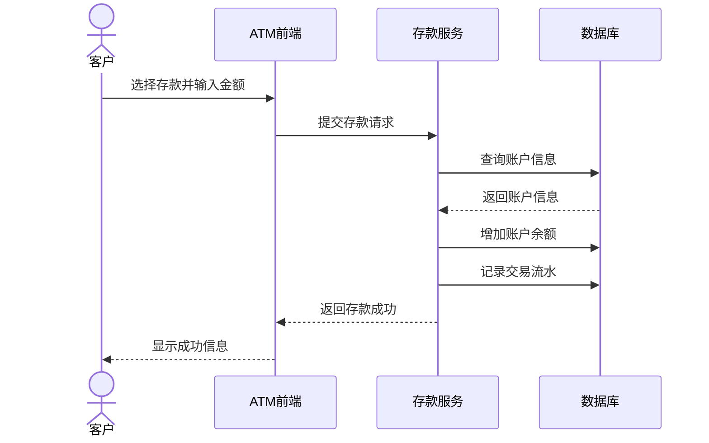

### 6.4 ATM 会话状态图

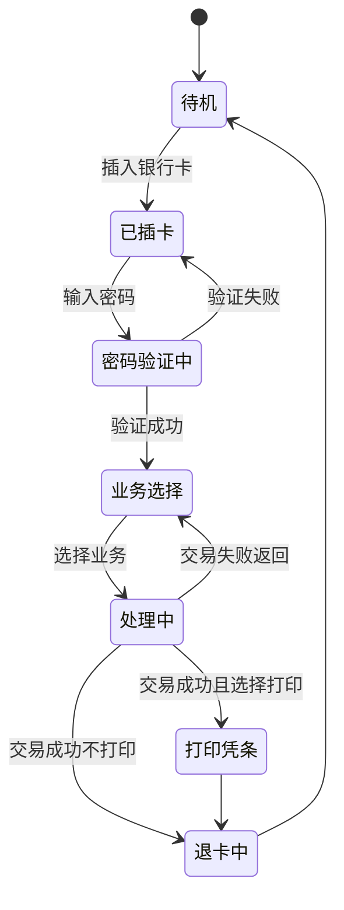

---

## 7. 第四章 细化迭代 3

### 7.1 组件图

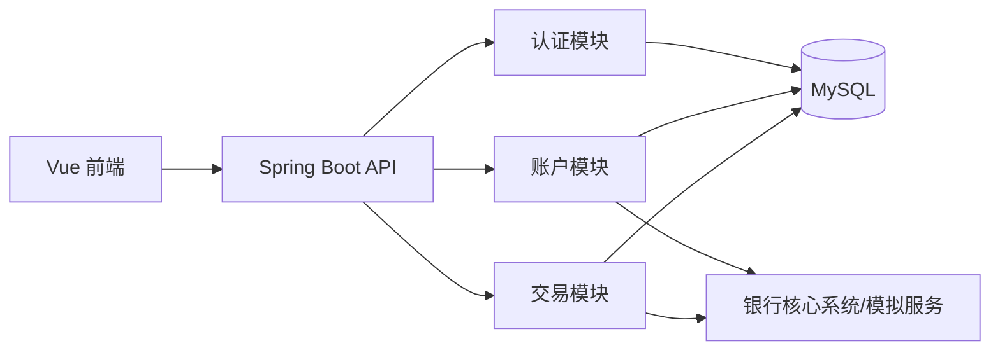

### 7.2 部署图

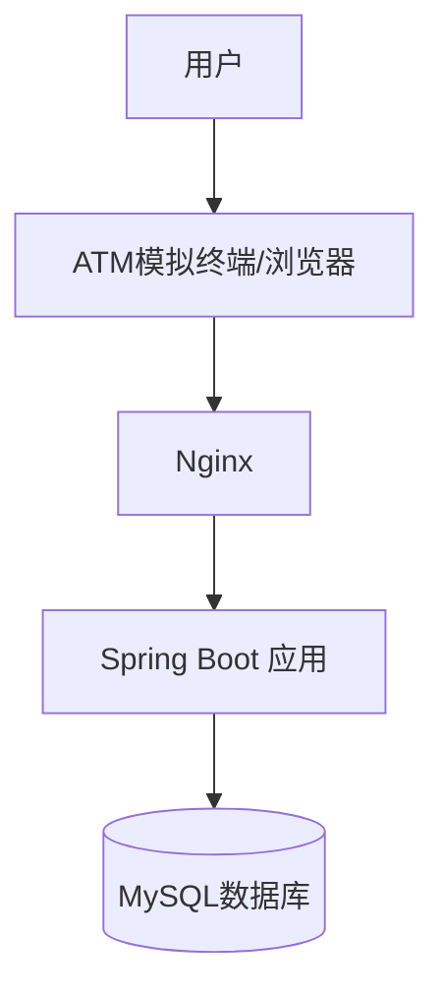

### 7.3 界面原型说明

建议设计以下界面：

- 欢迎页
- 插卡/登录页
- 主菜单页
- 查询余额页
- 取款页
- 存款页
- 转账页
- 修改密码页
- 凭条页

### 7.4 测试建议

建议至少覆盖以下测试场景：

- 正确密码登录
- 错误密码登录
- 余额充足时取款成功
- 余额不足时取款失败
- 转账到合法账户成功
- 转账到不存在账户失败
- 修改密码后重新登录验证

---

## 8. 第五章 总结与部署

### 8.1 系统总结

本 ATM 系统课程作业从需求分析出发，逐步完成用例建模、分析类设计、顺序交互建模、状态建模、组件设计与部署设计，形成了较完整的软件分析与设计成果。

系统采用 Vue + Spring Boot + MySQL 技术路线，结构清晰，功能划分明确，适合作为课程 UML 建模与系统实现的综合案例。

### 8.2 交付清单

本次作业建议最终提交以下内容：

- 需求分析说明
- 用例图
- 3 份核心用例规约
- 分析类图
- 活动图
- 登录顺序图
- 取款顺序图
- 转账顺序图
- 存款顺序图
- 状态图
- 组件图
- 部署图
- 数据库设计说明
- 代码实现说明

### 8.3 答辩建议

答辩时建议重点说明以下内容：

- 为什么选择 ATM 作为建模对象
- 系统主要参与者与核心业务
- 用例到类图、顺序图的推导过程
- 前后端分离架构的设计理由
- 取款与转账的异常处理逻辑

---

## 9. 附录：推荐命名规范

### 9.1 用例命名

- 登录
- 查询余额
- 取款
- 存款
- 转账
- 修改密码
- 打印凭条
- 退卡

### 9.2 类命名

- Customer
- BankCard
- Account
- ATM
- TransactionRecord
- AuthService
- AccountService
- TransactionService

### 9.3 包命名建议

- `controller`
- `service`
- `entity`
- `repository`
- `config`
- `common`

