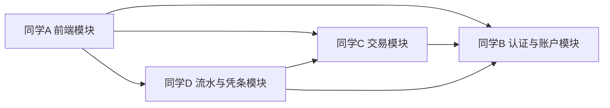

# ATM 系统四人分工与三次迭代任务安排

## 1. 分工原则

结合当前文档中的系统范围、接口设计和 UML 建模内容，将整个 ATM 系统任务拆分为四个相对独立且便于并行推进的模块。每位同学负责一个模块，并在三次迭代中逐步完成从分析、设计到实现和联调的工作。

分工目标如下：

- 保证每位同学都有明确的负责边界
- 保证每次迭代都有可见成果
- 保证模块之间接口清晰，便于最终集成
- 保证 UML 作业与代码实现能够对应起来

---

## 2. 四个模块划分

### 模块一：前端交互与 ATM 页面模块

负责人：同学 A

负责内容：

- ATM 前端页面设计与实现
- 页面路由管理
- 登录、菜单、查询、取款、存款、转账、修改密码、凭条等页面开发
- 与后端接口联调
- 页面状态控制与用户操作流程优化

对应技术：

- Vue 3
- Vite
- Vue Router
- Pinia
- Element Plus
- Axios

---

### 模块二：认证与账户管理模块

负责人：同学 B

负责内容：

- 登录认证接口实现
- 会话管理
- 查询余额
- 查询账户信息
- 修改密码
- 银行卡、账户相关数据模型设计

对应接口：

- `POST /api/atm/auth/login`
- `POST /api/atm/auth/logout`
- `POST /api/atm/auth/change-password`
- `GET /api/atm/accounts/balance`
- `GET /api/atm/accounts/profile`

对应技术：

- Java
- Spring Boot
- Spring Validation
- MyBatis 或 JPA

---

### 模块三：交易处理模块

负责人：同学 C

负责内容：

- 取款接口实现
- 存款接口实现
- 转账接口实现
- 交易业务规则校验
- 余额校验
- 交易状态与异常处理

对应接口：

- `POST /api/atm/transactions/withdraw`
- `POST /api/atm/transactions/deposit`
- `POST /api/atm/transactions/transfer`
- `GET /api/atm/transactions/{transactionId}`

对应技术：

- Java
- Spring Boot
- 事务控制
- 账户与交易领域模型

---

### 模块四：流水、凭条、设备与文档建模模块

负责人：同学 D

负责内容：

- 交易流水查询接口
- 凭条查询接口
- ATM 设备状态接口
- ATM 吐钞能力检查接口
- OpenAPI 文档维护
- UML 图与作业文档整理
- 集成测试与部署文档整理

对应接口：

- `GET /api/atm/transactions/history`
- `GET /api/atm/receipts/{transactionId}`
- `GET /api/atm/device/status`
- `POST /api/atm/device/cash-check`

对应技术：

- Java
- Spring Boot
- OpenAPI / Swagger
- Mermaid / UML 文档

---

## 3. 模块之间的协作关系

说明：

- 同学 A 依赖 B、C、D 提供接口。
- 同学 B 提供登录、账户与密码修改等基础能力。
- 同学 C 依赖 B 提供账户信息与会话校验。
- 同学 D 依赖 B 和 C 提供账户、交易与凭条数据来源。

---

## 4. 三次迭代总体目标

### 第一次迭代

目标：

- 明确需求与用例
- 完成 UML 初稿
- 完成数据库核心设计
- 建立前后端基础工程
- 跑通登录与查询余额基础功能

### 第二次迭代

目标：

- 完成核心交易功能
- 完成主要顺序图与设计类图
- 初步完成前后端联调
- 实现主要业务闭环

### 第三次迭代

目标：

- 完成流水、凭条与设备相关功能
- 完善异常处理和测试
- 完成 UML 文档终稿
- 完成整体集成与答辩材料

---

## 5. 第一次迭代任务分配

### 同学 A：前端交互与 ATM 页面模块

任务：

- 搭建 Vue 3 前端项目基础结构
- 配置路由、状态管理和接口请求封装
- 设计 ATM 欢迎页、登录页、主菜单页
- 实现登录页面与查询余额页面的原型
- 预留取款、存款、转账等页面入口

本次迭代交付物：

- 前端项目初始化代码
- 登录页
- 主菜单页
- 查询余额页原型

---

### 同学 B：认证与账户管理模块

任务：

- 搭建 Spring Boot 后端基础工程
- 设计客户、银行卡、账户实体
- 完成登录接口设计与实现
- 完成退出登录接口设计与实现
- 完成查询余额接口设计与实现
- 完成账户信息查询接口初版

本次迭代交付物：

- 后端基础工程
- 认证模块代码初版
- 账户模块代码初版
- 登录和查询余额接口可用

---

### 同学 C：交易处理模块

任务：

- 设计交易实体和交易状态字段
- 设计取款、存款、转账业务流程
- 完成交易模块接口草案
- 编写交易模块业务类骨架
- 输出取款和转账的业务规则说明

本次迭代交付物：

- 交易模块设计文档
- 交易相关实体类和服务类骨架
- 取款和转账业务流程说明

---

### 同学 D：流水、凭条、设备与文档建模模块

任务：

- 完成用例图初稿
- 完成取款用例规约
- 整理系统总体架构图
- 完成数据库 ER 图初稿
- 整理 OpenAPI 初版文档
- 确认设备状态和凭条模块需求

本次迭代交付物：

- UML 初稿
- 用例规约初稿
- OpenAPI 文档初版
- ER 图初稿

---

## 6. 第二次迭代任务分配

### 同学 A：前端交互与 ATM 页面模块

任务：

- 实现取款页面
- 实现存款页面
- 实现转账页面
- 实现修改密码页面
- 对接认证、账户和交易接口
- 优化页面交互提示和错误提示

本次迭代交付物：

- 核心业务页面代码
- 页面与接口联调结果
- 前端交互流程可演示

---

### 同学 B：认证与账户管理模块

任务：

- 完善账户信息查询接口
- 实现修改密码接口
- 补充会话校验逻辑
- 配合同学 C 完成交易前的身份和账户校验
- 优化异常返回格式

本次迭代交付物：

- 账户接口完整版
- 密码修改功能
- 统一返回结果结构

---

### 同学 C：交易处理模块

任务：

- 实现取款接口
- 实现存款接口
- 实现转账接口
- 实现交易详情接口
- 补充余额不足、目标账户不存在等异常处理
- 增加事务控制，保证转账操作一致性

本次迭代交付物：

- 交易模块核心代码
- 取款、存款、转账功能可用
- 交易详情查询功能可用

---

### 同学 D：流水、凭条、设备与文档建模模块

任务：

- 完成分析类图
- 完成设计类图
- 完成登录、取款、转账顺序图
- 设计流水查询接口和凭条接口
- 设计 ATM 设备状态接口
- 持续维护 OpenAPI 文档

本次迭代交付物：

- UML 中期版本
- 流水与凭条模块接口设计
- OpenAPI 中期版本

---

## 7. 第三次迭代任务分配

### 同学 A：前端交互与 ATM 页面模块

任务：

- 实现交易流水页面
- 实现凭条展示页面
- 完善设备状态提示
- 完成整体页面风格统一
- 完成所有页面测试与演示流程整理

本次迭代交付物：

- 前端完整演示版本
- 页面测试结果
- 演示流程说明

---

### 同学 B：认证与账户管理模块

任务：

- 优化登录安全控制
- 完善修改密码后的重新登录校验
- 完善账户信息和余额查询边界处理
- 协助整体联调与缺陷修复

本次迭代交付物：

- 认证与账户模块稳定版本
- 缺陷修复记录

---

### 同学 C：交易处理模块

任务：

- 优化取款、存款、转账的异常处理
- 完善交易状态记录
- 对接流水模块和凭条模块
- 完成交易模块测试
- 配合整体联调修复业务问题

本次迭代交付物：

- 交易模块稳定版本
- 测试记录
- 联调修复结果

---

### 同学 D：流水、凭条、设备与文档建模模块

任务：

- 实现交易流水查询接口
- 实现凭条查询接口
- 实现设备状态和吐钞能力检查接口
- 完成状态图、组件图、部署图
- 汇总所有 UML 图和课程文档
- 整理答辩 PPT 与最终说明材料

本次迭代交付物：

- 流水与凭条模块代码
- UML 终稿
- 作业最终文档
- 答辩材料

---

## 8. 每位同学的最终交付清单

### 同学 A

- 前端项目代码
- 登录、菜单、余额、取款、存款、转账、修改密码、凭条、流水页面
- 前端联调说明

### 同学 B

- 认证模块代码
- 账户模块代码
- 登录、退出、余额查询、账户信息、修改密码接口

### 同学 C

- 交易模块代码
- 取款、存款、转账、交易详情接口
- 交易规则与异常处理说明

### 同学 D

- 流水、凭条、设备模块代码
- OpenAPI 文档
- UML 图
- 作业说明文档
- 集成测试与答辩材料

---

## 9. 建议的协作节奏

为保证三次迭代可以顺利推进，建议每次迭代结束时统一进行一次阶段评审。

### 第一次迭代评审

- 检查需求是否统一
- 检查接口命名是否统一
- 检查 UML 初稿是否与业务一致

### 第二次迭代评审

- 检查核心功能是否联通
- 检查交易流程是否完整
- 检查接口文档是否与代码一致

### 第三次迭代评审

- 检查最终演示是否完整
- 检查 UML 是否齐全
- 检查答辩材料和提交文档是否完整

---

## 10. 总结

以上分工方案将 ATM 系统拆分为前端、认证与账户、交易、流水与文档四个模块，既能保证每位同学有明确职责，也能保证三次迭代都有清晰目标和实际成果。

这种分工方式适合课程作业场景，优点在于：

- 分工边界明确
- 可并行推进
- 便于 UML 与代码对应
- 便于答辩时说明每位成员承担的工作

