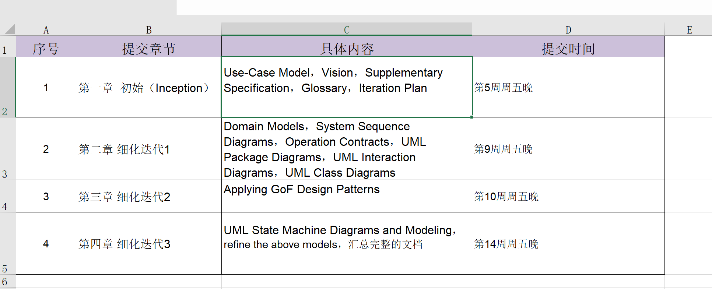

# ATM_Design
UML实验小组

## 总体迭代计划

<p align="center">
  
</p>


# 请大家注意pull request的查收，在main更新后及时merge到自己的分支哦！
1.  创建仓库。 
2.	所有人用 GitHub Desktop 把仓库 clone 到自己电脑。
3.	每个人新建自己的分支。
4.	每个人只在自己的分支上改。
5.	改完先 commit，再 push。
6.	到 GitHub 网页上开 Pull Request。
7.	组长或队友审核后再 merge。
8.	其他人 pull，拿到最新版本。

## 本地完整运行

Windows 下可以直接双击或在 PowerShell 执行：

```powershell
.\start-dev.cmd
```

脚本会启动两个窗口：

- 后端：`http://localhost:8080/api/atm`，使用 `dev` 内存数据库并自动初始化演示账号
- 前端：`http://localhost:5173`

演示账号：

- 卡号：`6222020000000001`
- 密码：`123456`

如果手动启动，先开后端：

```powershell
cd .\atm-server-auth
.\mvnw.cmd spring-boot:run -Dspring-boot.run.profiles=dev
```

再开一个终端启动前端：

```powershell
cd .\frontend
npm install
npm run dev:real
```

前端开发服务会通过 Vite proxy 把 `/api/atm/**` 转发到 `http://localhost:8080`，浏览器里只需要打开 `http://localhost:5173`。

只体验前端 Mock 流程可以运行：

```powershell
cd .\frontend
npm install
npm run dev:mock
```
