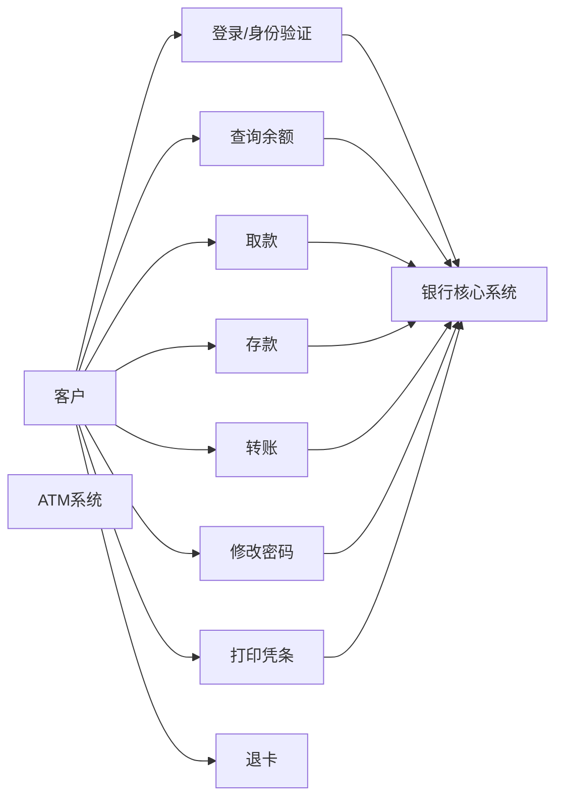

# 软件分析设计与建模实验

## ATM 系统课程作业提交文档

| 项目 | 内容 |
| --- | --- |
| 课程名称 | 软件分析设计与建模实验 |
| 班级 | 2024级软件工程1班 |
| 小组成员 | 马启凡、叶炳良、周子栋、庄子杰 |
| 当前阶段 | 初始化 |

## 第一章 初始阶段

### 1.1 系统背景

ATM 自动取款机系统是银行面向客户提供自助金融服务的重要终端。通过 ATM，客户可以在非柜台场景下完成取款、存款、查询余额、转账、修改密码、打印凭条和退卡等操作，从而减少人工柜台压力，提高业务处理效率，并改善客户的自助服务体验。

本课程作业以 ATM 虚拟系统为研究对象，结合《软件分析设计与建模实验要求》以及小组作业方案，完成系统分析、需求建模、接口规划和后续分阶段实现。项目采用前后端分离方式组织：

- 前端使用 Vue 3、Vite、Vue Router、Pinia、Axios
- 后端使用 Java 17、Spring Boot、Spring Web、Validation、MyBatis
- 数据存储使用 MySQL
- 建模和文档采用 Markdown、Mermaid、OpenAPI

本系统的建设目标如下：

- 建立一个可演示的 ATM 业务原型系统
- 支持 ATM 核心业务流程的分析与建模
- 为后续三次迭代开发提供统一的需求基础
- 保证 UML 建模文档能够与后续代码实现对应

根据 `ATM_UML作业方案.md` 和 `ATM_四人分工与三次迭代任务.md`，系统后续将围绕以下核心功能逐步展开：

- 插卡登录
- 密码验证
- 查询余额
- 取款
- 存款
- 转账
- 修改密码
- 打印凭条
- 退卡

本章属于初始阶段文档，重点不是实现全部功能，而是完成系统背景说明、参与者识别、用例分析和核心用例规约，为后续细化迭代建立分析基础。

### 1.2 参与者识别

结合 ATM 系统实际业务场景和课程作业范围，识别出本系统的主要参与者如下。

#### 1.2.1 客户

客户是 ATM 系统的主要直接参与者，负责发起各类业务操作。客户通过插卡、输入密码和选择功能菜单，与 ATM 系统进行交互，可执行以下行为：

- 登录验证
- 查询余额
- 取款
- 存款
- 转账
- 修改密码
- 打印凭条
- 退卡

#### 1.2.2 银行核心系统

银行核心系统是 ATM 系统的重要外部支撑参与者，不直接操作 ATM 界面，但为 ATM 提供关键业务数据和校验能力，主要承担以下职责：

- 校验银行卡和密码是否合法
- 提供账户信息与余额信息
- 支持取款、存款、转账等交易处理
- 记录交易流水
- 返回业务处理结果

#### 1.2.3 ATM 设备

ATM 设备作为业务承载终端，负责连接客户操作和后台服务，其职责包括：

- 接收客户输入
- 展示业务菜单和处理结果
- 吐钞
- 打印凭条
- 退卡
- 反馈设备状态

在用例分析中，ATM 设备通常作为系统边界的一部分，因此本章重点将其作为系统运行环境进行说明。

#### 1.2.4 管理员（可选参与者）

在课程作业的扩展场景中，可将管理员作为次要参与者，负责设备状态检查、日志查看和系统维护。但在本次初始阶段中，管理员不作为核心业务建模对象，仅保留为可扩展角色。

### 1.3 系统边界与功能范围

根据作业方案，ATM 系统边界可定义为“客户通过 ATM 前端与系统交互，系统调用后台服务和数据库完成认证、账户处理与交易处理，并返回结果”。

本系统当前纳入分析范围的功能包括：

- 身份认证：插卡、输入密码、登录验证、退卡
- 账户业务：查询余额、查询账户信息、修改密码
- 交易业务：取款、存款、转账
- 辅助业务：打印凭条、查询交易流水、设备状态检查

本课程项目不重点覆盖的内容包括：

- 真实银行级密码加密体系
- 跨行结算细节
- 复杂风控策略
- 生产级设备驱动与硬件通信协议

因此，本系统定位为一个适合课程分析设计与建模的 ATM 业务模拟系统。

### 1.4 用例图

根据初始阶段识别的参与者和功能范围，可得到 ATM 系统的总体用例关系如下：

由上图可见：

- 客户是触发全部核心业务的直接参与者
- 银行核心系统为认证、账户查询和交易处理提供支撑
- 退卡属于 ATM 系统内部直接完成的终止型业务
- 打印凭条与具体交易结果关联，属于交易后的辅助功能

### 1.5 核心用例规约

结合初始化阶段的任务要求，本章选择“取款”“查询余额”“登录认证”三个代表性用例进行规约说明。这三个用例分别覆盖了交易类、查询类和认证类场景，能够支撑后续分析类图和顺序图的细化。

#### 1.5.1 用例一：登录认证

- 用例名称：登录认证
- 用例编号：SUC001
- 参与者：客户
- 前置条件：客户已持有有效银行卡，ATM 设备运行正常
- 后置条件：系统建立有效会话，客户进入主菜单；若失败，则停留在登录流程
- 用例简述：客户通过插卡和输入密码完成身份验证，登录 ATM 系统

主要流程：

1. 客户将银行卡插入 ATM。
2. ATM 系统读取卡号信息并提示输入密码。
3. 客户输入密码。
4. ATM 系统将卡号和密码提交给后台认证模块。
5. 认证模块调用银行核心系统或账户数据完成校验。
6. 系统返回认证成功结果。
7. ATM 系统建立当前会话并显示主菜单。

替代流程：

1. 若银行卡状态异常，则系统提示该卡不可用。
2. 若密码错误，则系统提示重新输入。
3. 若连续多次输入错误，则系统可终止本次会话。
4. 若后台服务不可用，则系统提示暂时无法登录。

特殊要求：

- 登录成功后应进入统一业务菜单
- 登录失败不得暴露敏感认证信息
- 会话建立后才能访问余额查询和交易功能

#### 1.5.2 用例二：查询余额

- 用例名称：查询余额
- 用例编号：SUC002
- 参与者：客户
- 前置条件：客户已完成登录认证
- 后置条件：系统展示当前账户余额信息
- 用例简述：客户在 ATM 上查询当前账户可用余额

主要流程：

1. 客户在主菜单中选择“查询余额”。
2. ATM 系统向账户服务发起余额查询请求。
3. 账户服务根据当前会话获取账户信息。
4. 系统读取账户余额数据。
5. ATM 系统将余额结果展示给客户。
6. 客户可选择返回主菜单或结束操作。

替代流程：

1. 若会话失效，则系统提示重新登录。
2. 若账户信息不存在，则系统提示查询失败。
3. 若后台服务异常，则系统提示稍后重试。

业务规则：

- 余额查询必须基于有效会话
- 只允许查询当前登录账户的余额
- 结果应以清晰金额格式展示

#### 1.5.3 用例三：取款

- 用例名称：取款
- 用例编号：SUC003
- 参与者：客户
- 前置条件：客户已完成登录认证，账户状态正常，ATM 设备现金充足
- 后置条件：账户余额被扣减，系统生成交易记录，并可选择打印凭条
- 用例简述：客户在 ATM 上输入取款金额，系统校验通过后完成扣款和吐钞

主要流程：

1. 客户登录系统并进入主菜单。
2. 客户选择“取款”功能。
3. ATM 系统提示客户输入取款金额。
4. 客户输入金额并确认。
5. 系统校验金额格式和取款规则。
6. 系统校验账户余额是否充足。
7. 系统校验 ATM 当前现金是否充足。
8. 系统完成账户扣款。
9. ATM 执行吐钞。
10. 系统记录交易流水。
11. 系统提示是否打印凭条。
12. 客户选择打印凭条或直接返回菜单。

替代流程：

1. 若金额不合法，则系统提示重新输入。
2. 若余额不足，则系统提示交易失败。
3. 若 ATM 现金不足，则系统提示暂时无法完成取款。
4. 若交易处理过程中发生异常，则系统回滚交易并提示失败。

业务规则：

- 取款金额必须满足 ATM 业务金额规则
- 账户余额不足时不得扣款
- 吐钞前必须保证扣款成功
- 交易完成后必须记录流水

#### 1.5.4 用例四：转账

- 用例名称：转账
- 用例编号：SUC004
- 参与者：客户
- 前置条件：客户已完成登录认证
- 后置条件：转出账户扣款成功，目标账户入账成功，系统记录交易流水
- 用例简述：客户通过 ATM 向其他账户发起转账

主要流程：

1. 客户登录后选择“转账”功能。
2. 输入目标账户和转账金额。
3. 系统校验目标账户是否存在。
4. 系统校验当前账户余额是否充足。
5. 系统执行扣款和目标账户入账。
6. 系统记录交易流水。
7. 系统提示转账成功，并可选择打印凭条。

替代流程：

1. 目标账户不存在，系统提示失败。
2. 当前账户余额不足，系统提示失败。
3. 后台处理异常，系统提示转账失败。

### 1.6 本章小结

本章完成了 ATM 系统初始阶段的需求分析基础工作，主要包括：

- 明确系统背景、建设目标和项目边界
- 识别客户、银行核心系统等主要参与者
- 建立 ATM 系统总体用例图
- 对登录认证、查询余额、取款、转账等核心用例进行了规约

这些内容构成了后续细化迭代的分析基础。下一章将在此基础上继续细化分析类图、活动图和顺序图，并推动系统从需求分析进入结构化设计与实现阶段。
